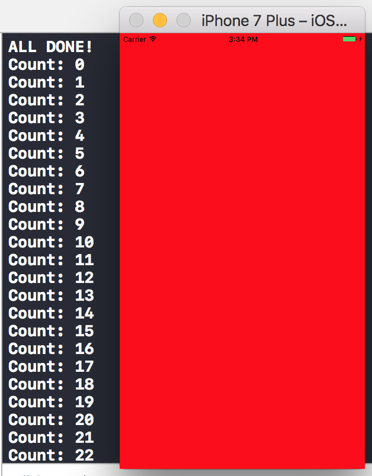

# AC3.2-Closures-InDepth
---

### Objective

- To review what we already have covered on closures in swift
- To explore the "lifetime" of a closure in the context of a function
- Lastly, to look at `@escaping` closures and their common usages

### Readings

1. [Chapter 9: Closures - We ❤️ Swift](https://www.weheartswift.com/closures/)
2. [Closures - Swift From Scratch](https://code.tutsplus.com/tutorials/swift-from-scratch-closures--cms-23138)
3. [Escaping and Nonescaping Closures - Swift Unboxed](https://swiftunboxed.com/lang/closures-escaping-noescape-swift3/)

#### Further Readings:

1. [Introduction to Closures in Swift 3 - Jayven via Medium](https://medium.com/ios-os-x-development/introduction-to-closures-in-swift-3-1d46dfaf8a20)
	- This is a good resource to see how to translate a function into a closure
2. [Closures - Swift By Example](http://brettbukowski.github.io/SwiftExamples/examples/closures/)
	- Quick reference to closures

#### Vocabulary

- **Closure**: Closures are self-contained blocks of functionality that can be passes around and used in your code. - [Apple](https://developer.apple.com/library/content/documentation/Swift/Conceptual/Swift_Programming_Language/Closures.html)
- **Callback**: A callback is any executable code that is passed as an argument to other code, which is expected to *call back* (execute) the argument at a given time. - [Wiki](https://en.wikipedia.org/wiki/Callback_(computer_programming))
- **Concurrent**: When two tasks overlap in execution. [Quora](https://www.quora.com/What-is-concurrency-in-programming)
- **Queue**: A block of code that can be executed synchronously or asynchronously, either on the main or on a background thread. - [AppCoda](https://www.appcoda.com/grand-central-dispatch/)
- **Asynchronous**: Essentially, code that is executed on a background thread so it doesn't block the main thread. - [SO](https://stackoverflow.com/questions/9200558/grand-central-dispatch-async-vs-sync). For a look at sync v. async and serial v. concurrent see [this answer](https://stackoverflow.com/questions/19179358/concurrent-vs-serial-queues-in-gcd?noredirect=1&lq=1).

---

### 1. Reviewing what we know

#### Comparing Closures to Functions

Closures are simply blocks of code that we want to run at some point. In this regard, they are no different than functions. For example, say we wanted to create a function that is used to print out a greeting for a user. We may want to pass in the user's name as a `String` and expect to get back a formatted `String`. For that we could write something like: 

```swift 
// This closure's type is
// (String) -> String
func greet(name: String )-> String {
  return "Hello, \(name)!"
}
greet(name: "Louis") // returns "Hello, Louis!"
```

#### Closures as variables

It's possible to execute the exact same code, in pretty much the same manner by writing it using a closure:

```swift
// This closure's type is
// (String) -> String
let greetClosure = { (name: String) -> String in
  return "Hello, \(name)!"
}
greetClosure("Louis") // returns "Hello, Louis!"
```

The syntax looks a bit different between the two, but functionally they are the same. 

You may be wondering why/how we assigned our closure's code to a variable. This is a language feature of Swift: functions are treated as *first class citizens*, which means that closures can be used in any way a primitive or `Foundation` type can be. One of those uses is assigning closures to variables to be used later in code. This is why we can store our block of code in a variable, and then run that code everytime we call `greetClosure`. 

But this isn't exclusive to closures, you can assign functions to variables as well:

```swift
let greetFunc = greet // remember, greet() is of type (String) -> String
greetFunc("Louis") // returns "Hello, Louis!"
```

It's worth repeatng, functions and closures are very similar!


#### Closures as function parameters

Another feature of first-class citizenship is being able to be passed to a function as a parameter. Closures can be passed to functions as parameters so long as they match the type the parameter is expecting. Let's say we have a couple of these `greet`-based functions and wanted a simple way to print them out. We could write a function that accepted the same type as the function (`(String) -> String`) and passed that along to a `print` statement:

```swift
func printGreetMessage(name: String, msg: (String) -> String) {
  let message = msg(name) // msg is a closure of type (String)->String, which is why we can pass it in the name parameter
  print(message)
}
printGreetMessage(name: "Louis", msg: greetClosure) // prints "Hello, Louis!"
```

Now, if we had other closures for other messages, we could re-use this function to print them out:

```swift
let newMailMessage = { (name: String) -> String in
  return "\(name), You have unread messages."
}
printGreetMessage(name: "Louis", msg: newMailMessage) // prints "Louis, You have unread messages"
```

#### Closures as function return values

Closures can also be returned as values themselves:

```swift
// this returns a type (String)->String
func logoutMessage() -> (String)->String {
  return { (name: String) -> String in
    return "You have been logged out, \(name)"
  }
}
let logout: (String)->String = logoutMessage()
logout("Louis") // prints "You have been logged out, Louis"
```

In this example `logout` is a variable that contains a closure of type `(String)->String`. To actually run the code in the closure, we pass it the one `String` parameter it is expecting. This in turn gets treated as the `name: String` parameter in the closure and finally the formatted `String` gets returned. 

#### Trailing Closures

There is a special syntax for functions where their last parameter is a closure, which is called *trailing closure syntax*. Looking back at the `printGreetMessage` function, we could rewrite a call to the function like so:

```swift
printGreetMessage(name: "Louis") { (str: String) -> String in
  return "Hey \(str)! You have new friend requests" // returns "Hey Louis! You have new friend requests"
}
```

This allows you to define your closure code inline, rather than passing it in as a variable. There are many reasons for using trailing closure syntax, and one very common situation that you'll see them are in making network requests.  

---

### 2. Lifetime of a closure

You've probably already heard and experienced that a closure "captures" the environment in which it is defined; meaning that in the scope of the closure, variable state can be stored/updated long after the execution of a function would have terminated.

For example, the code contained in this function is executed immediately and terminates when the `return` is called. All variables within the scope of that function, `messagePrefix` and `helloMessage`, no longer exist in memory after that `return` statement. That is to say, those variables are created at the time the function is called, and not being needed anyone, they are removed. 

```Swift
func sayHelloNow(name: String) -> String {
  let messagePrefix = "Hey, its been awhile"
  let helloMessage = messagePrefix + " \(name)"
  
  return helloMessage
}
print(sayHelloNow(name: "Louis")) // prints "Hey, its been awhile Louis"
```

This is in contrast to a closure, which "keeps alive" defined objects in its scope:

```swift
func sayHelloEventually(name: String) -> ()->String {
  // 1. 
  let messagePrefix = "Hey, its been awhile"
  
  // 2.
  let sayHello = {
    return messagePrefix + " \(name)"
  }
  
  // 3.
  print("Returning Hello")

  // 4.
  return sayHello
}

// 5.
let pendingMessage = sayHelloEventually(name: "Louis")
print(pendingMessage())
```

1. We define a local constant, `messagePrefix` to hold some text to use later.
2. A closure, `sayHello` is defined and "captures" both the local constant `messagePrefix` and passed parameter `name`
3. We perform a `print` statement to illustrate the moment just before the function `return`s, to signify that the function has run its code and is about to complete. 
4. We return the closure, `sayHello`
5. We assign the result of `sayHelloEventually` to a new `let`. This constant, `pendingMessage`, is of type `(Void)->String`. But what's interesting, is that when we call `print(pendingMessage())`, the closure that is stored in `pendingMessage` **still knows of the existance of the local constant `messagePrefix` and to the parameter we passed earlier!!** That's why it's able to still print this information out, long after the function has finished running!

It'll take a little while to grasp this concept, but you'll see that extending the lifetime of a closure is very advantageous for network calls, which take much longer to finish than executing the code that starts them. The closure stays "alive" long enough for the network requests to complete, ensuring that we don't have a situation where we call a function expecting some network `Data` and the function finishes running before the network finishes returning the needed `Data`.

---
### 3. Asynchronous Request

> Note: These examples are more easily done in an Xcode Project, rather than playgrounds. For the rest of this lesson, work in `ViewController.swift` of the project repo

Let's write out a task that's going to take a few seconds to run:

```swift
class ViewController: UIViewController {

  override func viewDidLoad() {
    super.viewDidLoad()
    // Do any additional setup after loading the view, typically from a nib.
    
  }
  
  override func viewDidAppear(_ animated: Bool) {
    self.longRunningTask()
    self.view.backgroundColor = .red
  }

  // run time will vary on your machine, but make sure this takes a few seconds before it completes
  func longRunningTask() {
    for i in 0...250000{
      print("Count: \(i)")
    }
  }
}

```

You should see all of the numbers from `0...250,000` print out in the console, followed by the `view.background` changing to `.red`. 


Its not uncommon that a network request (especially with bad cell service) takes this long to retrieve the contents from a webpage and then to display them on screen. Though, network requests don't generally hold up UI changes, meaning that making a request that takes a long time to finish shouldn't interfere with how we interact with the app. For example, text will load much quicker on a webpage than images. But you've definitely been in a situation where you can scroll through the page as the images start to get loaded. Imagine if you couldn't do *anything* until *every single thing* on that page was downloaded, ads and all! Not a great experience. 

Network requests happen *asynchronously*, meaning that they can happen out of order and finish independent of any other request. Update your code in `longRunningTask` to this: 

```swift
  func longRunningTask() {
    
    DispatchQueue.global().async {
      for i in 0...250000{
        print("Count: \(i)")
      }
    }

  }
```

Notice the difference!? 

#### A metaphor 

Now instead of waiting for the loop to complete, the background of the view updates immediately. We've made our task *asynchronous*; it now gets started and finishes sometime later, but it doesn't hold everything else up. Asynchronous tasks get separated out into different *queues* in order to run code *concurrently*. Imagine this:

You're at a grocery store, and you only need to buy granola. Just a single, lonesome bag of granola. So you walk in, grab the bag and stroll to the checkout. Bad news: there is only one register open and there are a huge line of customers ahead of you in the *queue* to checkout. For the most part, the customers ahead of you have only a handful of items each, so getting through everyone should be fairly quick, eventhough there are a lot of them. 

You take a look all the way down to the start of the *queue* and you notice the hold up: a single customer with 3 carts-full of groceries. If only there were other *queue* open so that you didn't have to depend (*synchronicity*) on all of the customers (*task*) ahead of you! 

But what luck, soon several more cashiers come over and open up their tills. The customers then spread out to the other tills making much shorter *queues*. The customer with the 3 carts is still being rung up as you sail by on your way home, but it doesn't really matter because you (and the other customers/tasks) got what you needed in a timely fashion. And remaining customer will still eventually be taken care of. 

#### DispatchQueue

A `DispatchQueue` is essentially like an addition checkout register: you can push tasks on one to be run independantly of tasks running in other queues. Calling `.global()` instantiates one of these cash registers (which is kind of like getting the cashier to actually open and work on the queue). We specify that we want the queue to be `async`hronous so that this task doesn't hold up anything else. 

The result is that we can put a long running task on its own queue, and get back to making sure our app is working on other stuff. 

#### Lifetime of Queues and Closures

Let's make another change to `longRunningTask` by having it return something:

```swift
  func longRunningTask() -> String {
    
    DispatchQueue.global().async {
      for i in 0...250000{
        print("Count: \(i)")
      }
    }

    return "ALL DONE"
  }
```
Also, change `viewDidAppear` to have this: `print(self.longRunningTask())`. Now rerun the project. 



Wait, how did the function finish and `return "All Done"` before the loop finished? Well, our long-running loop has been **pushed off** into another queue and so code execution returns to normal. The lifetime of the function ends, but the lifetime of that loop continues on another queue until its done. This is why we get our return value well before we finish our task. 

This doesn't really seem consequential until you come into a situation when you need the result of a long-running task from a function! For example, let's add in a new function named `longAdditionTask`:

```swift
  override func viewDidAppear(_ animated: Bool) {
	//    print(self.longRunningTask())
    self.longAdditionTask()
    self.view.backgroundColor = .red
  }
  
  func longAdditionTask() {
    print("Starting Addition")
    let result = Array(0...10000000).reduce(0, +) // this creates an array of all Int values from 0 to 10,000,000 and adds them all up
    print("Finished Addition")
  }
```

Run the project now and notice we get the same result as before using `DispatchQueue`: The task starts, gets held up, and eventually finishes. 

Now change it so that we use the result of our addition task:

```swift
  override func viewDidAppear(_ animated: Bool) {
  // print(self.longRunningTask())
    print("Done, ", self.longAdditionTask())
    self.view.backgroundColor = .red
  }

  func longAdditionTask() -> Int {
    print("Starting Addition")
    let result = Array(0...10000000).reduce(0, +) 
    return result
  }
```

> Note: We add in `print` statements to get some visual indication that a task is started/running/completed

We still haven't solved the waiting issue (having to wait for the return value) though, so lets wrap things up in another `DispatchQueue` call: 

```swift
  func longAdditionTask() -> Int {
    print("Starting Addition")
    var result = 0
    
    DispatchQueue.global().async {
      result = Array(0...10000000).reduce(0, +)
    }
    
    return result
  }

```

Great! Now re-run the project: 


Wait, what? The view changed to red almost immediately but it printed out 0 as the result

Here's why:

1. We make a call to `longAdditionTask`
2. Code executions line by line in the function, printing `"Starting Addition"` in console and instantiating `result = 0`
3. `DispatchQueue` pushes off the task that's taking the most time off to another queue
4. Code in `longAdditionTask` continues to execute line by line
5. The *current* value of `result`, which is 0, gets returned and the function finishes.
6. Later on, the long running task on the `DispatchQueue` finishes and assigns its value to `result`... which no longer is of any use since `result` only lives in the lifetime  of the `longAdditionTask` function and that function has finished a long time ago. 

Then the question remains: Where performing lengthy tasks, how can we wait in order to get the correct return values? 

CLOSURES! But not just any type of closures, `@escaping` closures. 


### 4. Escaping Closures

Escaping closures are a special beast: they extend the lifetime of a closure to ensure we have enough time to get the result of a long running task. They are found in functions defined with least one closure parameter and are marked  `@escaping`. 

> `escaping` closures are often referred to as "callbacks"

So in our example, let's see how this would affect our code:

```swift
  // 1.
  func longAdditionTask(callback: @escaping (Int)->Void) {
    print("Starting Addition")
    var result = 0
    
    DispatchQueue.global().async {
      result = Array(0...10000000).reduce(0, +)
      
      // 2.
      callback(result)
    }
  }
```

1. We need to change the declaration of `longAdditionTask` to accept a single parameter of `(Int)->Void`. We also need to declare the closure as being `@escaping` because the contents and scope of the closure *"escape"* the lifetime of the function -- meaning it will continue to live and have other code access its stored values long after the function itself finishes execution. 
2. To pass our needed `result: Int`, we give it to the `callback` closure parameter.

> *Remember, `callback` is of type `(Int)->Void` meaning it accepts a single `Int` parameter and returns nothing. So working with this closure is done exactly the same way as described earlier in "Closures as Variables" and "Closures as Parameters".*

To call this new function, we'll use trailing syntax back in `viewDidAppear`:

```swift
    self.longAdditionTask { (result: Int) in
      print("Done, ", result)
    }
```

Ok, run the project one last time and observe the difference! 


#### Excellent work! We've accomplished a lot:

1. We no longer hold up the rest of our code because of our long task
2. And we can access the proper value as soon as its ready

If this still doesn't seem 💯 yet, dont worry. You're going to get used to them pretty quickly: closures are awesome and are used all over! 

😎

---
### 4. Exercises

> Instructions: Please complete the exercises found in the `Exercises` playground page. In the `Sources` folder of the page, you will be writing in your answers in `ClosureExercise.swift`, inside the scope of the `ClosureExercise` class. You can call your code in `ClosureExercise` from the main playground page in `Exercises`. Be sure to make your functions `public` to be able to call them from outside of the `Sources` folder.

> When you're ready, you can run the test suite by uncommenting the line: 

`TestRunner().runTests(testClass: ClosureTests.self)`

> Note: The file `ClosureTests.swift` should not be changed, but can be used as a reference in order to write your code. 